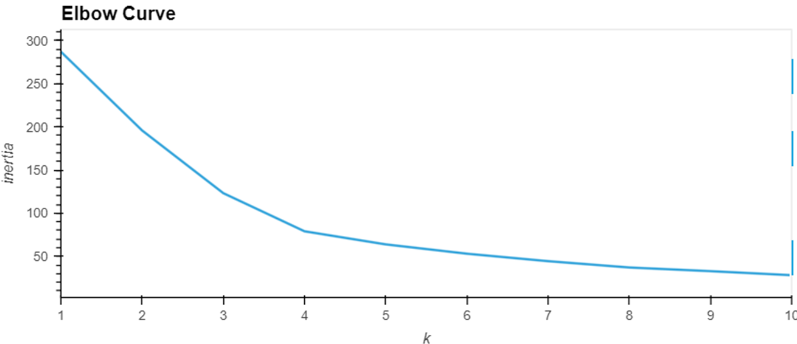
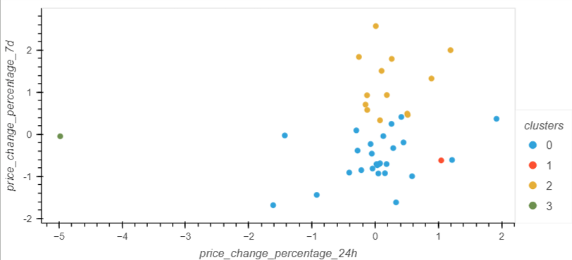
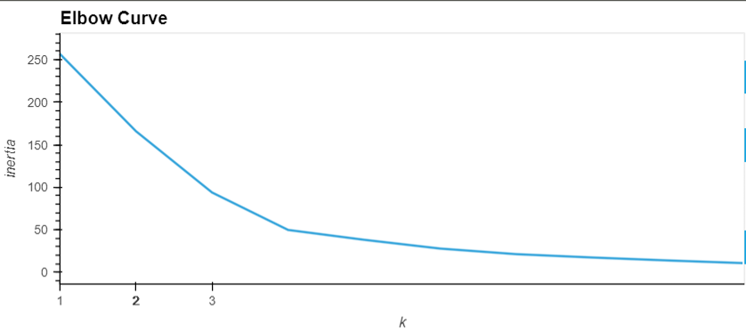
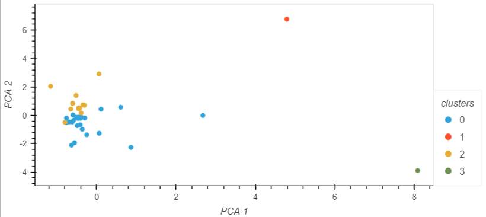

# CryptoClustering

Read in crypto pricing history
Scaled the data using StandardScaler from scikit-learn
Used KMeans from scikit-learn create and fit the model and plotted the inertia on an elbow curve
    -identified 4 as the optimal value of k
    

Created and fit the KMeans model based off the identified clusters as 4
Created predictions and plotted the clusters based on the first two features
    

Created a Principal Component Analysis model with 3 features which accounted for about 90% of the variability
Used KMeans from scikit-learn create and fit the model and plotted the inertia on an elbow curve for the PCA data
    -identified 4 as the optimal value of k which is the same as before
    

Created and fit the KMeans model based off the identified clusters as 4
Created predictions and plotted the clusters based on the first two PCA features
    

After comparing the results of the two different models we're able to better identify the outliers visually with PCA. With the first two PCA clusters, we're able to account for 72% of the variation and accurately group our data points vs the full data where the pattern for clustering isn't visibly clear.
